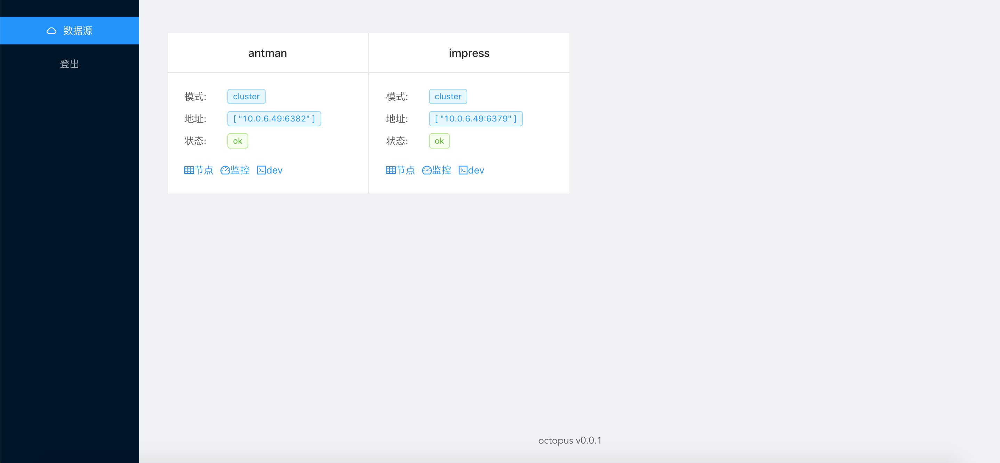
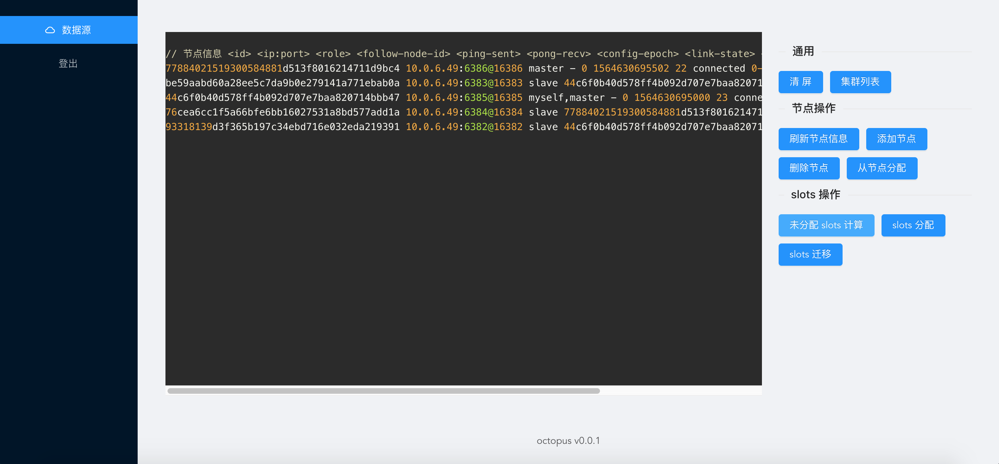

[](https://travis-ci.com/wziww/octopus)
### TODO LIST
- [ ] es 集群操作及监控
- [ ] mysql 监控及操作
- [ ] 宿主机指标采样监控
  - [ ] 内存
  - [ ] cpu
  - [ ] load
  - [ ] irq
  - [ ] disk
---
### REDIS
#### 集群模式
- [x] 节点列表
- [x] 集群内存实时监控
- [x] 集群上下行流量监控
- [x] 集群 ops 监控
- [x] 集群慢日志监控
- [x] 集群命中率监控
- [x] 节点内存分析
- [ ] config 文件分析
- [ ] bigkeys 扫描
- [ ] hotkeys 扫描
- [x] rdb 分析
- [x] del 命令规范化（各类型数据各自细致化操作避免 block 节点）（redis 6.x BIO 之前）
## build
> 服务端
```shell
  make build
```
> 前端
> 编译配置 vi ./src/src/config/index.js > 更改为你需要的 host
```shell
  cd src && npm run build
```
## start
```shell
  ./octopus -c ./your_config.toml
```
## config example
```toml
[server]
listen_address="0.0.0.0:8081" # websocket port
[[redis]]
  name="impress"
  address=["10.0.6.49:6379"]
  # password="viewer"
[[redis]]
  name="antman"
  address=["10.0.6.49:6382"]
  db=0
[log]
  # log_path="./tmp/"  # 日志存放目录,需人为创建好目录，不设置该值的时候，默认 stdout 进行日志输出
  log_level=["LOGERROR"] # LOGNONE 「禁止输出」 |  LOGERROR「错误级别日志」  |  LOGWARN「警告级别」  |  LOGDEBUG「debug 级别，该级别包含大量日志（含所有操作命令记录），谨慎使用」    默认 LOGERROR
[auth-config]
  key="F$&&*F*J)"
[[auth]]
  user="root"
  password="root"
  # dev | monit | exec
  permission=["dev","monit","exec"]  
[[auth]]
  user="viewer"
  password="viewer"
  # dev | monit | exec
  permission=[]  
```
## opcap
> 什么是 opcap 插件
- opcap 是基于 libpcap 以 cpp 实现的 tcp 层面的嗅探插件，目前提供了分析 redis 实时命令的功能
- 同时提供基础 tcp 功能，例如 telnet xxx.xxx.xxx.xxx 9712
- 命令： ping、get、quit
- get 命令获取实时统计结果，每行 k-v 以标准 CRLF 结尾
>  依赖： libpcap libpcap-devel
> centos: yum install libpcap && yum install libpcap-devel
``` shell
  # build
  cd cpp && make build
  # run
  # flags -d「device」 -f「BPFFilter」-t「time(s) to clear count」
  ./opcap -fdst port 6380 -deth0 -t1000
```
> opcap 使用示例


## Demo



